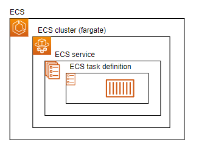
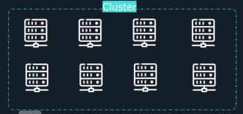
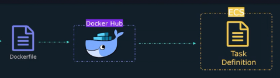
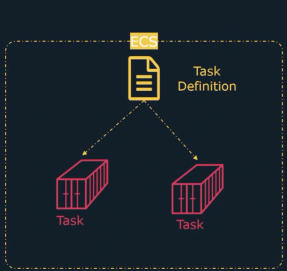
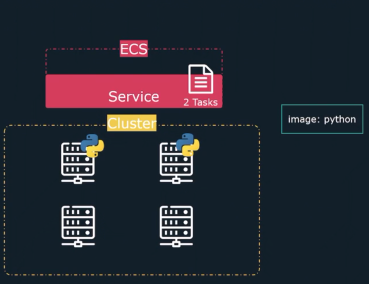
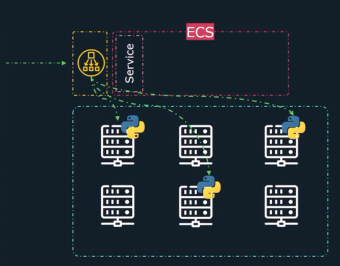

# Launch an Application on Elastic Container Service (ECS) with Terraform

## Overview
This project demonstrates the usage of serverless compute to save time and cost with ECS Fargate during the launch of an Application

### Service used

* Elastic Container Service (ECS)

#### Elastic Container Service 

1- **What is ECS?**

ECS is a managed containers orchestrator. It can be put in the same family as Docker Swarm and Kubernetes. Orchestrator means managing the lifecycle of containers(create/restart, destroy) , deploying , load-balancing application traffic accross multiple servers , and autoscaleing to handle variance in traffic

2- **What is ECS cluster?**

Ecs cluster is a set of resources that containers will run on. Those resources are based of EC2 virtual machines

3- **ECS launch types**

    - EC2 launch type : customers manage the underlying EC2 instances
    
    - Fargate launch type: AWS manage the underlying infrastructure

4 - **ECS components**

    - ECS Task Definition:   template that describes how container(s) are supposed to be launched

    

    - ECS Task :  running containers with instruction defined in the Task Definition

    

     - ECS Services : ensures that a certain number of Tasks are running at all the times

     

     - ECS and Load Balancer: LB can be assigned to route external traffic to your Service

     

