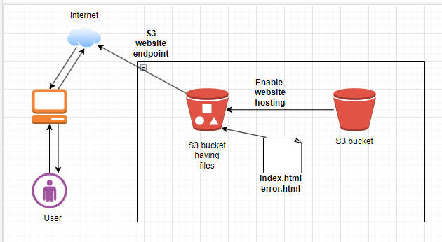
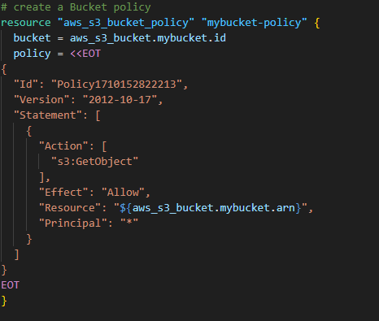
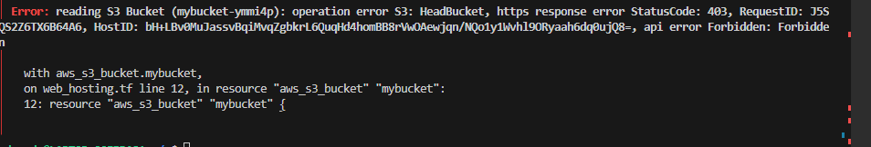
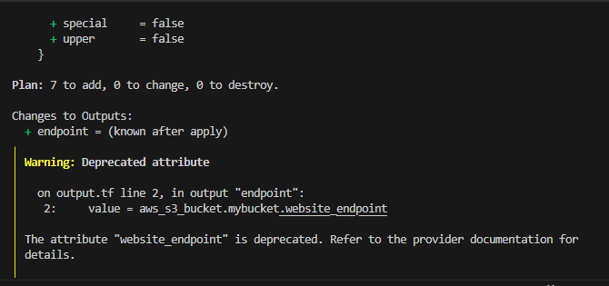
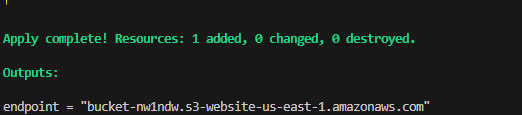
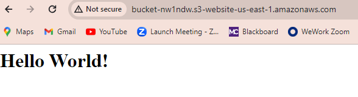

# Static Website Hosting in AWS S3 using Terraform

## Project Description:
In this work, I designed an infrastructure for hosting a static website. This static website is hosting in AWS, specifically in S3. And I use Terraform to build it. The main objective is to enlight the automated provisioning and deployment of a Static Website.

## Architecture Diagram


## Implimentation

### I- Environment set up

* Create an AWS account

* Install Terraform  (https://developer.hashicorp.com/terraform/tutorials/
aws-get-started/install-cli) 

* Install AWS command line interface (CLI) (https://docs.aws.amazon.com/cli/latest/userguide/getting-started-install.html)

### II- Add AWS credentials in Terraform

* Create  a User in your AWS  account

* Create an Access Key for that User with permissions based on your needs
  - Use case **Command Line Interface (CLI)**
  - Copy and paste  your Secret and Access keys to a safe place
* Use AWS profile because is better compared to other methods of authentification. Run the commands below on your local CLI:
```
# 1
aws configure

# 2 Enter your Access Key
AWS Access Key ID:

# 3 Enter your Secret Key
AWS Secret Key ID:

# 4 Enter your Region
Default region name:

# 5 Type Enter
Default output format
```

### III- Prepare your website Content

 Create a folder HTML with 2 files: index.html and error.html. Make sure that Terraform can access that folder.

 ### IV- File Syntax

  Terraform configuration files ends with the extension **".tf"**
  (Example: variables.tf)

### V- Write your configuration files in your prefer IDE

* Visual Studio

### VI- Define a Provider

 Create a file called **profile.tf** where we defined the provider we intended to use (AWS). Syntax is shown below:
```
provider "aws" {
    region= "us-east-1"
}
```
### VII- Initialization of  Terraform

we run the command below and make sure that we are in the directory where we defined our configuration files. That command install the neccessary plugins and modules required to connect to our Provider (AWS).
```
terraform init
```
### VIII- Create a Resource file 

* Called the resource file : **resource.tf**

* Generate a random string with the **random_string resource**. That will help us create a random alphanumeric characters.
```
   resource "random_string" "string" {
             length           = 6
             special          = false
             lower            = true
             upper            = false
             numeric           = true
              
}
```
* Implement a S3 Bucket using the **string** from **randon_string resource** to have a **Unique** Bucket name
```
resource "aws_s3_bucket" "mybucket" {
  bucket = "mybucket-${random_string.string.result}"

}
```
* Run the command below to officially create a S3 Bucket:
```
terraform apply -auto-approve
```
### IX- Debugging
we have to delete all the file(.terraform , terrafor.tfstate , etc ....) and add **"/*"** at the end of **${aws_s3_bucket.mybucket.arn}** and rewrite the policy to solve the errors below:




### X- Create a output file
We use website_endpoint attribute, which is **Deprecated**. So change the output attribute according to your need


     
### XI- Outcomes



### XII- Tear down the Infrastructure
use the command below to destroy the infrastructure
```
terraform destroy -auuto-approve
```


